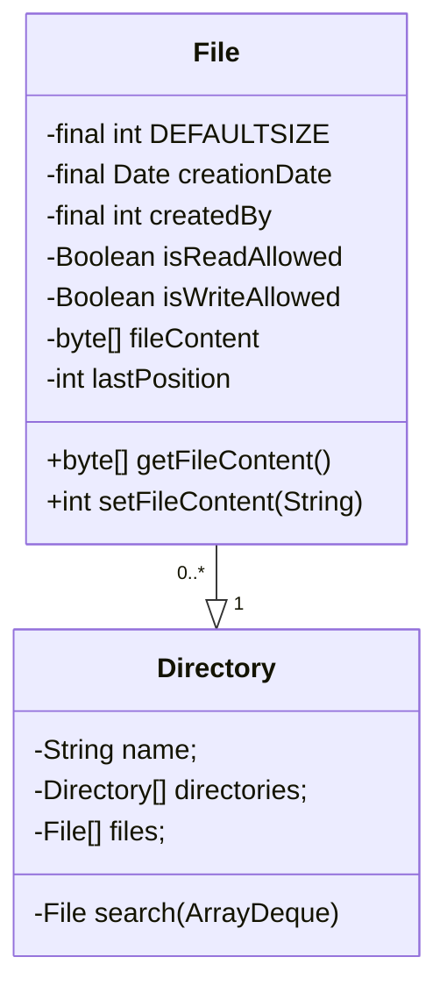
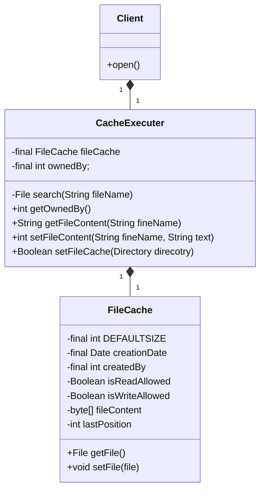

```mermaid
classDiagram
  File "0..*" --|> "1" Directory

  class File{
    -final int DEFAULTSIZE
    -final Date creationDate
    -final int createdBy

    -Boolean isReadAllowed
    -Boolean isWriteAllowed

    -byte[] fileContent
    -int lastPosition

    +byte[] getFileContent()
    +int setFileContent(String)
  }

  class Directory{
    -String name;
    -Directory[] directories;
    -File[] files;

    -File search(ArrayDeque<String>)
  }

```

```mermaid
classDiagram
  Client "1" *-- "1" CacheExecuter
  CacheExecuter "1" *-- "1" FileCache

  class Client{

    +open()
  }

  class CacheExecuter {
    -final FileCache fileCache
    -final int ownedBy;

    -File search(String fileName)

    +int getOwnedBy()

    
    +String getFileContent(String fineName)

    +int setFileContent(String fineName, String text)

    +Boolean setFileCache(Directory direcotry)
  }
  
  class FileCache{
    -final int DEFAULTSIZE
    -final Date creationDate
    -final int createdBy

    -Boolean isReadAllowed
    -Boolean isWriteAllowed

    -byte[] fileContent
    -int lastPosition

    +File getFile()
    +void setFile(file)
  }

```

CacehExecuterを間に挟むことで、ClientがFileに関する好きな情報をgetしたりsetするのを簡単にする