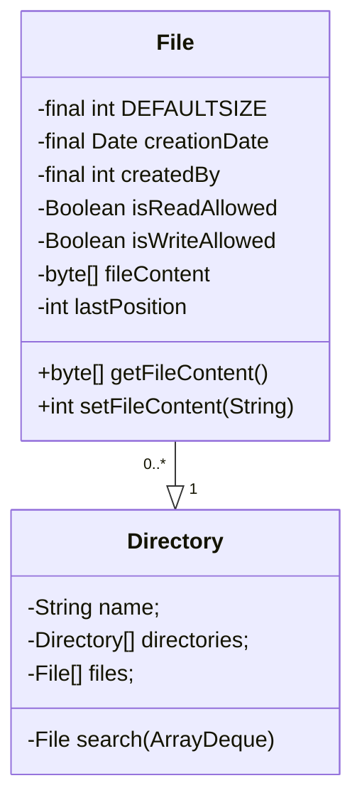

```mermaid
classDiagram
  File "0..*" --|> "1" Directory

  class File{
    -final int DEFAULTSIZE
    -final Date creationDate
    -final int createdBy

    -Boolean isReadAllowed
    -Boolean isWriteAllowed

    -byte[] fileContent
    -int lastPosition

    +byte[] getFileContent()
    +int setFileContent(String)
  }

  class Directory{
    -String name;
    -Directory[] directories;
    -File[] files;

    -File search(ArrayDeque<String>)
  }

```