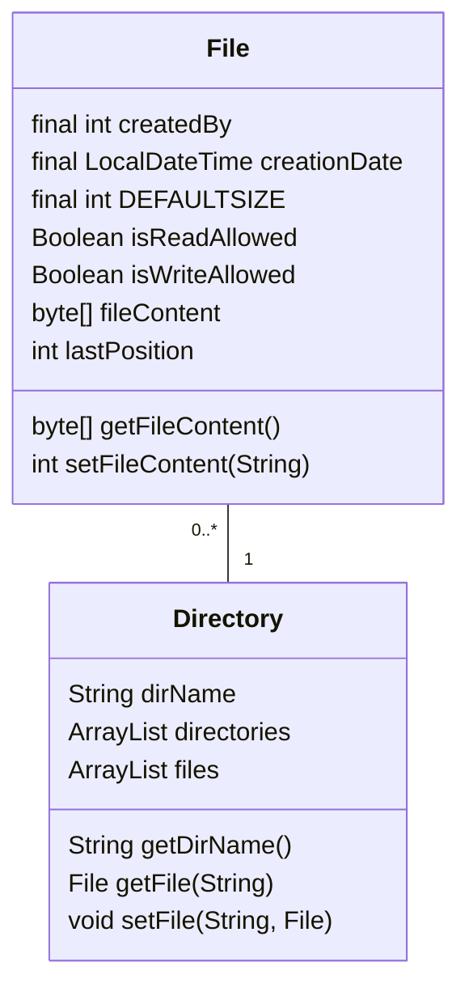
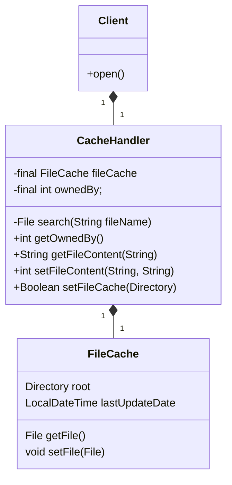

```mermaid
classDiagram
  File "0..*" -- "1" Directory

  class File{
    final int createdBy
    final LocalDateTime creationDate
    final int DEFAULTSIZE

    Boolean isReadAllowed
    Boolean isWriteAllowed

    byte[] fileContent
    int lastPosition

    byte[] getFileContent()
    int setFileContent(String)
  }

  class Directory{
    String dirName
    ArrayList<Directory> directories
    ArrayList<File> files

    String getDirName()
    File getFile(String)
    void setFile(String, File)
  }

```

```mermaid
classDiagram
  Client "1" *-- "1" CacheHandler
  CacheHandler "1" *-- "1" FileCache

  class Client{

    +open()
  }

  class CacheHandler {
    -final FileCache fileCache
    -final int ownedBy;

    -File search(String fileName)

    +int getOwnedBy()

    
    +String getFileContent(String )

    +int setFileContent(String, String)

    +Boolean setFileCache(Directory)
  }
  
  class FileCache{
    Directory root
    LocalDateTime lastUpdateDate

    File getFile()
    void setFile(File)
  }

```

CacheHandlerを間に挟むことで、
ClientがFileに関する情報をget/setするのを助ける