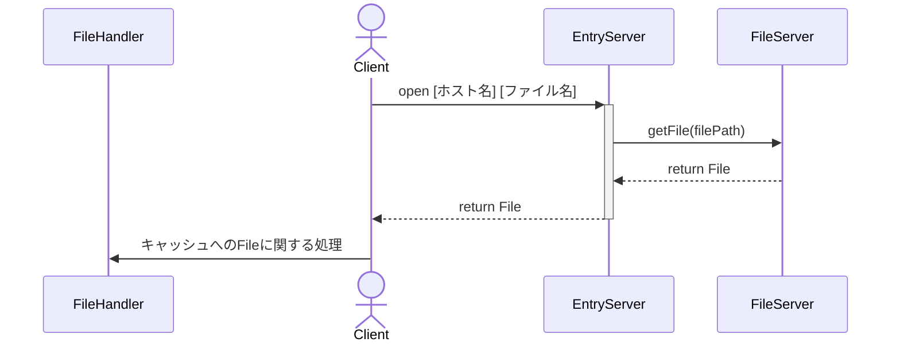
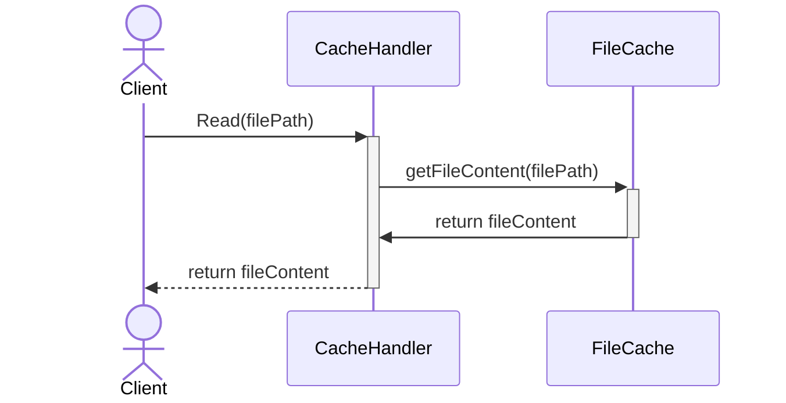
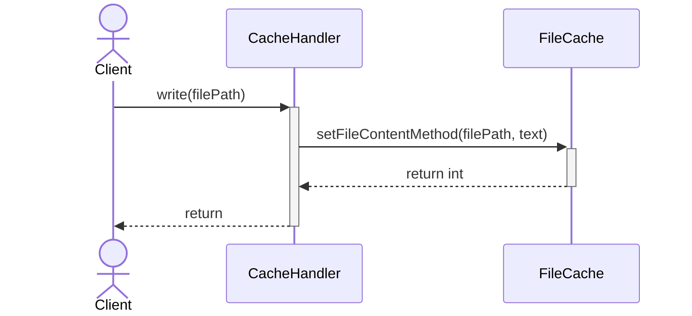

# Clientがサーバーからファイルを取得する

```mermaid
sequenceDiagram

  participant FH as FileHandler
  actor C as Client
  participant ES as EntryServer　
  participant FS as FileServer

  C->>+ES: open [ホスト名] [ファイル名]
  ES->>FS: getFile(filePath)
  FS-->>ES: return File
  ES-->>-C: return File
  C->>FH: キャッシュへのFileに関する処理
```

# ClientがファイルをReadする

```mermaid
sequenceDiagram

  actor C as Client
  participant CH as CacheHandler
  participant FC as FileCache

  C->>+CH: Read(filePath)
  CH->>+FC: getFileContent(filePath)
  FC->>-CH: return fileContent
  CH-->>-C:  return fileContent
```

# ClientがFileをwriteする

```mermaid
sequenceDiagram

  actor C as Client
  participant CH as CacheHandler
  participant FC as FileCache

  C->>+CH: write(filePath)
  CH->>+FC: setFileContentMethod(filePath, text)
  FC-->>-CH: return int
  CH-->>-C:  return 
```

