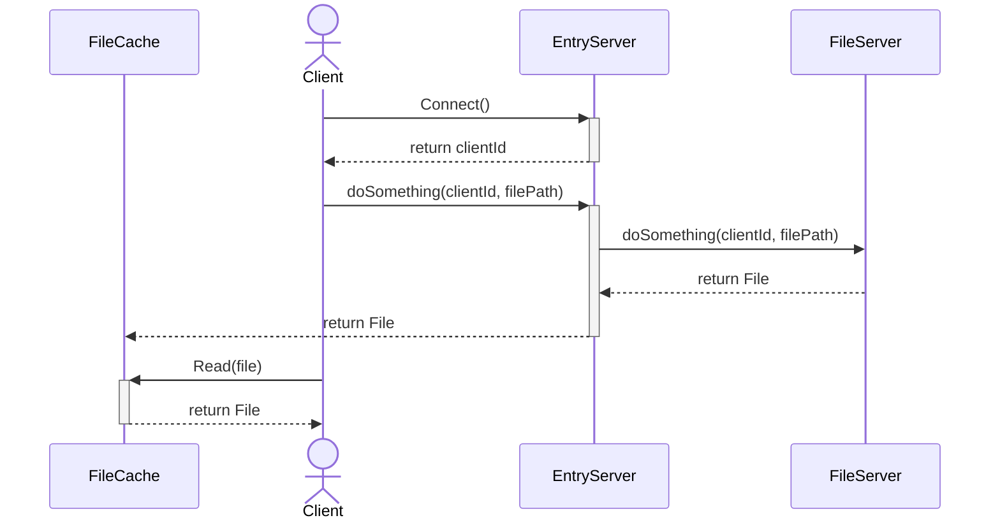
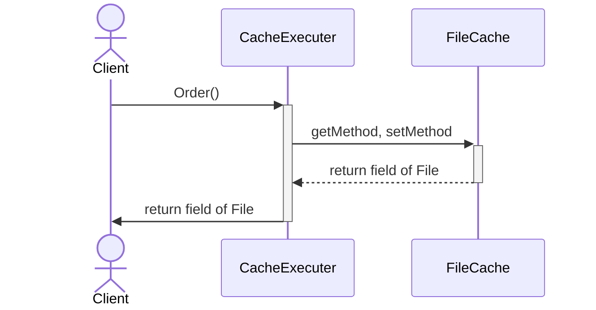

- 全てのClientはEntryServer(ES)にのみアクセスする
- ESはClientにclientIdを付与する
- ESとFSがやりとりしてファイルに関する操作を行う
- clientIdとファイルに関する命令を受けてESがFSに対してなんらかの操作をする。もしファイルの受け渡しがあればそれをClientのFileCache(FC)に渡す

- ClientはCacheExecuterを通じてFileCacheからFileに関する情報を得る
**CacheExecuterに仲立ちさせる理由**
  - 他のClientのwriteによってFileCache内の更新が起こるときに、その更新をFileCacheではなく、CacheExecuterにしてほしいから。
  - FileCacheはあくまでもFileの保管庫であり、その保管庫を操作するのは保管庫自身ではない方がいいと思う。
  - Clientに担当させないのは、ユーザーにFileCacheの管理を意識させたくないから
