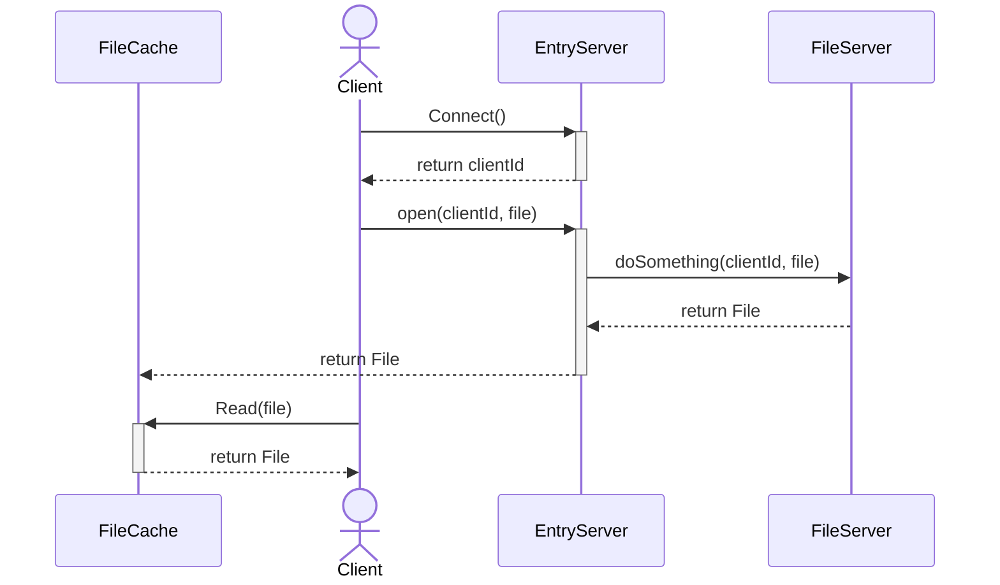

```mermaid
sequenceDiagram

  participant FC as FileCache
  actor C as Client
  participant ES as EntryServer　
  participant FS as FileServer

  C->>+ES: Connect()
  ES-->>-C: return clientId 
  C->>+ES: open(clientId, file)
  ES->>FS: doSomething(clientId, file)
  FS-->>ES: return File
  ES-->>-FC: return File
  C->>+FC: Read(file)
  FC-->>-C: return File
```
- 全てのClientはEntryServer(ES)にのみアクセスする
- ESはClientにclientIdを付与する
- ESとFSがやりとりしてファイルに関する操作を行う
- clientIdとファイルに関する命令を受けてESがFSに対してなんらかの操作をする。もしファイルの受け渡しがあればそれをClientのFileCache(FC)に渡す