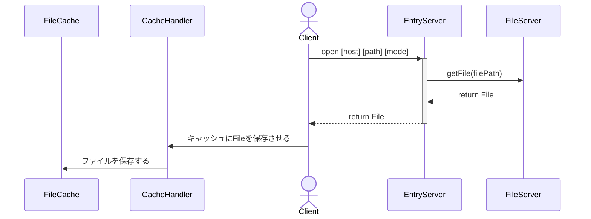
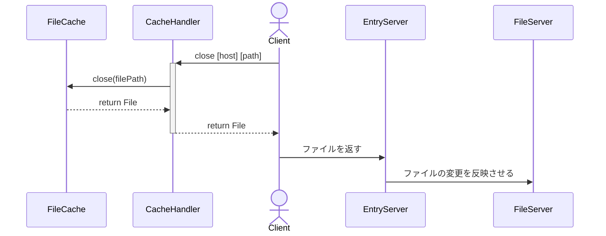
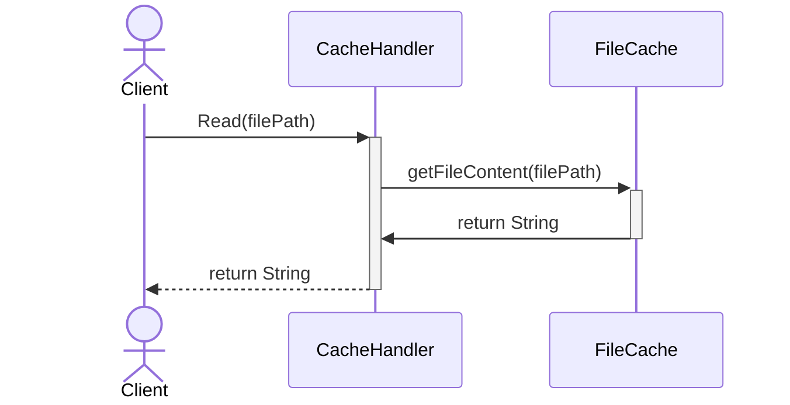
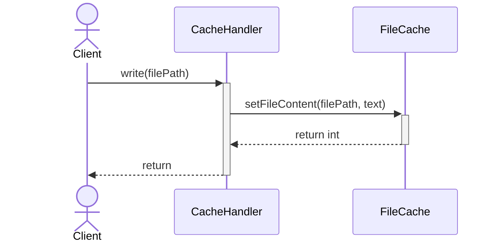

# Clientがサーバーからファイルを取得する

```mermaid
sequenceDiagram

  participant FC as FileCache
  participant CH as CacheHandler
  actor C as Client
  participant ES as EntryServer　
  participant FS as FileServer

  C->>+ES: open [host] [path] [mode]
  ES->>FS: getFile(filePath)
  FS-->>ES: return File
  ES-->>-C: return File
  C->>CH: キャッシュにFileを保存させる
  CH->>FC: ファイルを保存する
```

# キャッシュからサーバーにファイルを戻す

```mermaid
sequenceDiagram

  participant FC as FileCache
  participant CH as CacheHandler
  actor C as Client
  participant ES as EntryServer　
  participant FS as FileServer

  C->>+CH: close [host] [path]
  CH->>FC: close(filePath)
  FC-->>CH: return File
  CH-->>-C: return File
  C->>ES: ファイルを返す
  ES->>FS: ファイルの変更を反映させる
```

# ClientがファイルをReadする

```mermaid
sequenceDiagram

  actor C as Client
  participant CH as CacheHandler
  participant FC as FileCache

  C->>+CH: Read(filePath)
  CH->>+FC: getFileContent(filePath)
  FC->>-CH: return String
  CH-->>-C:  return String
```

# ClientがFileをwriteする

```mermaid
sequenceDiagram

  actor C as Client
  participant CH as CacheHandler
  participant FC as FileCache

  C->>+CH: write(filePath)
  CH->>+FC: setFileContent(filePath, text)
  FC-->>-CH: return int
  CH-->>-C:  return 
```
