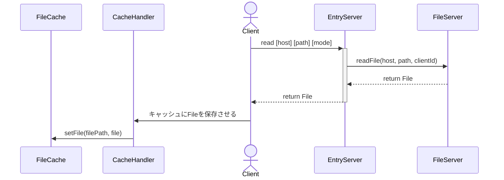
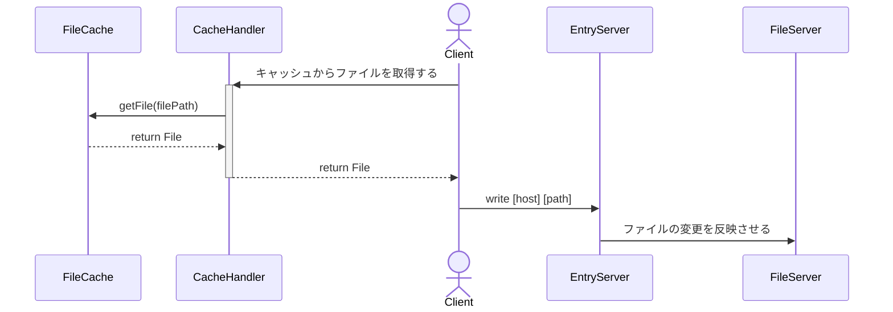
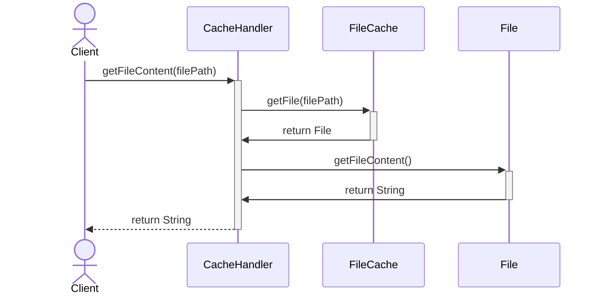
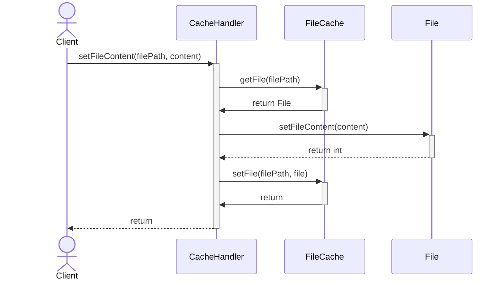

# クライアントがサーバからファイルを取得する

```mermaid
sequenceDiagram

  participant FC as FileCache
  participant CH as CacheHandler
  actor C as Client
  participant ES as EntryServer　
  participant FS as FileServer

  C->>+ES: read [host] [path] [mode]
  ES->>FS: readFile(host, path, clientId)
  FS-->>ES: return File
  ES-->>-C: return File
  C->>CH: キャッシュにFileを保存させる
  CH->>FC: setFile(filePath, file)
```

# キャッシュに対する変更内容をサーバに反映する

```mermaid
sequenceDiagram

  participant FC as FileCache
  participant CH as CacheHandler
  actor C as Client
  participant ES as EntryServer　
  participant FS as FileServer

  C->>+CH: キャッシュからファイルを取得する
  CH->>FC: getFile(filePath)
  FC-->>CH: return File
  CH-->>-C: return File
  C->>ES: write [host] [path]
  ES->>FS: ファイルの変更を反映させる
```

# クライアントがファイルの内容を読み出す

```mermaid
sequenceDiagram

  actor C as Client
  participant CH as CacheHandler
  participant FC as FileCache
  participant F as File

  C->>+CH: getFileContent(filePath)
  CH->>+FC: getFile(filePath)
  FC->>-CH: return File
  CH->>+F: getFileContent()
  F->>-CH: return String
  CH-->>-C:  return String
```

# クライアントがファイルの内容を書き換える

```mermaid
sequenceDiagram

  actor C as Client
  participant CH as CacheHandler
  participant FC as FileCache
  participant F as File

  C->>+CH: setFileContent(filePath, content)
  CH->>+FC: getFile(filePath)
  FC->>-CH: return File
  CH->>+F: setFileContent(content)
  F-->>-CH: return int
  CH->>+FC: setFile(filePath, file)
  FC->>-CH: return
  CH-->>-C:  return 
```
